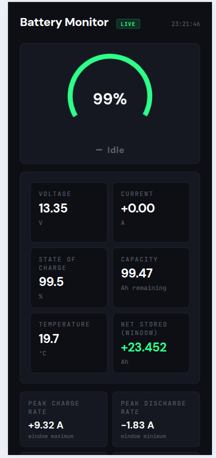
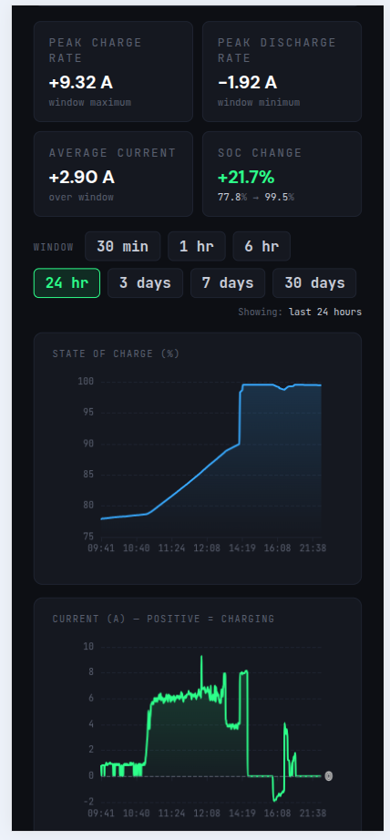
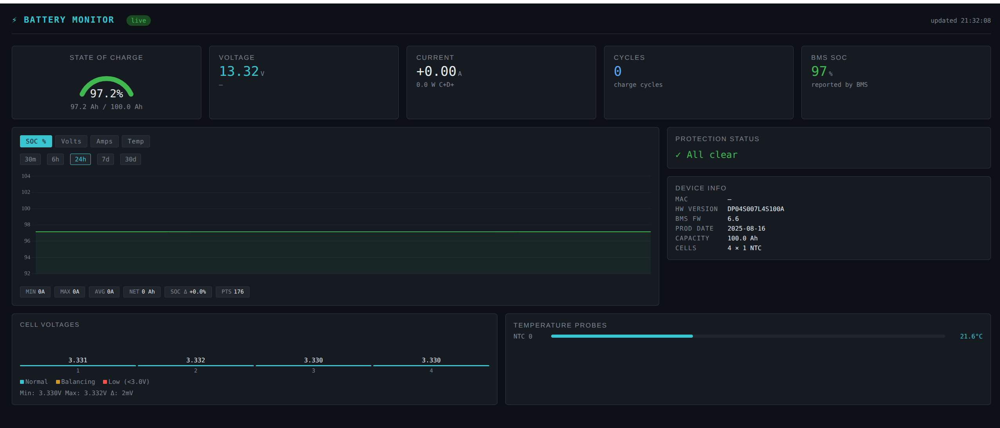

# Ecoworthy-Battery-Monitor-Web

**eco-worthy-battery-logger** rewrite, as there was no Licence. Improvements to BLE stability and added SQLite logging for use with a web interface.

Original project, and inspiration: https://github.com/mike805/eco-worthy-battery-logger

---

## Overview

This project has three components:

- `ecoworthy-battery-monitor.py` – collects data from the battery via BLE
- `webapp.py` – Flask web interface for viewing stored data
- `maintain_db.py` – database retention and summarisation tool

---

## ecoworthy-battery-monitor.py

This script connects to the battery over BLE and records telemetry data.

### Usage

```bash
/path/to/env/bin/python ecoworthy-battery-monitor.py [-h] -m MAC [-i INTERVAL] [-l FILE] [-d FILE] [-v]
```

### Options

| Option | Description |
|--------|-------------|
| `-h`, `--help` | show this help message and exit |
| `-m MAC`, `--mac MAC` | BMS Bluetooth MAC address (e.g. `a5:c2:37:01:2f:ed`) |
| `-i INTERVAL`, `--interval INTERVAL` | Poll interval in seconds (default: 10) |
| `-l FILE`, `--csv FILE` | Append readings to this CSV file |
| `-d FILE`, `--db FILE` | Store readings in this SQLite database |
| `-v`, `--cells` | Also read individual cell voltages |

### Example

```bash
/path/to/env/bin/python ecoworthy-battery-monitor.py \
  -m a5:c2:37:6d:9f:de \
  -i 10 \
  -d /path/to/database/batt.db -v
```

---

## webapp.py

Flask web application that reads the SQLite database and displays battery data.

### Usage

```bash
/path/to/env/bin/python webapp.py [-h] [-p PORT] [-D DEBUG] -d DATABASE
```

### Example

```bash
/path/to/env/bin/python webapp.py -p 8080 -d /path/to/batt.db
```

### Options

| Option | Description |
|--------|-------------|
| `-h`, `--help` | Show help message and exit |
| `-p PORT`, `--port PORT` | Port number (default: 5001) |
| `-D DEBUG`, `--debug True/False` | Enable/disable Flask debug mode |
| `-d DATABASE`, `--database DATABASE` | Path to SQLite database |

### Access

Default URL:

- http://localhost:5001  
- http://IP_ADDRESS:5001  
- http://FQDN:5001  

---

## Requirements

Install dependencies:

```bash
source /path/to/venv/bin/activate
pip install bluepy Flask
```

> Note: `sqlite3`, `argparse`, and `jsonify` are part of the Python standard library.

---

## maintain_db.py

Performs tiered retention and summarisation of `batt.db`.

### Cron example

```bash
0 3 * * * /path/env/bin/python3 /path/to/maintain_db.py -d /path/to/batt.db
```

### Options

| Option | Description |
|--------|-------------|
| `-d`, `--database` | Path to `batt.db` (required) |
| `--dry-run` | Show what would be deleted without deleting |
| `-v`, `--verbose` | Enable verbose output |

### Retention policy

| Retention tier | Policy |
|----------------|--------|
| 0 – 24 hours   | keep every raw row |
| 1 – 7 days     | keep one row per minute (delete rest) |
| 7 – 30 days    | keep one row per 10 minutes |
| 30 – 365 days  | summarise to hourly buckets (delete raw rows) |
| 365+ days      | summarise to daily buckets (delete raw rows) |

Summarisation writes into `battery_summary` before deleting raw rows, preserving min/max/avg statistics.

---

## Screenshots

  
  
  

